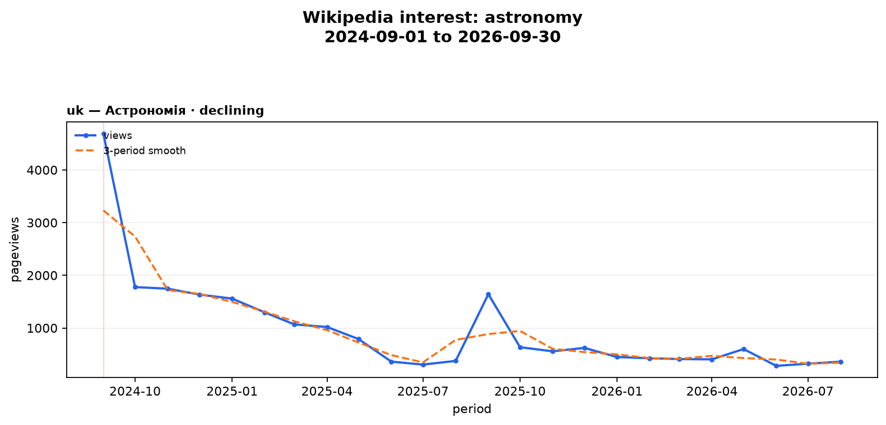

# Wikipedia Interest

Wikipedia Interest is a small Agent Skill and CLI for turning fuzzy audience-research questions into reproducible signals from Wikimedia Pageviews. An agent supplies topic, languages and dates; deterministic Python code resolves Wikipedia articles, retrieves cached data, calculates robust trends and anomalies, assesses evidence quality, and produces a chart or one-page PDF.

It is intentionally not a market-size estimator. Wikipedia attention can help choose what to validate next; it cannot prove demand, conversion, willingness to pay or product-market fit.

## Example

Natural-language request:

> Compare the growth of interest in intermittent fasting in Polish and Czech Wikipedia over the last two years and tell me which signal is more reliable.

Command:

```bash
uv run wikipedia-interest analyze \
  --topic "intermittent fasting" --languages pl,cs \
  --start 2024-09 --end 2026-09 --granularity monthly --output output
```

The command prints one compact JSON object and saves a full `output/<run-id>/result.json`, `data.csv`, normalized `pageviews.json`, and `chart.png`. The persisted result includes observations; stdout omits them by default for small models. The agent can summarize `comparison.strongest_signal`, explain each `series[].metrics.trend_label`, and quote `series[].reliability.reasons`.

## Architecture

```text
user question
    ↓ agent maps intent to CLI flags
resolver → MediaWiki search + interlanguage links
    ↓
cached Wikimedia Pageviews → deterministic metrics/anomalies/reliability
    ↓
JSON + chart + one-page PDF → agent explanation with caveats
```

The LLM handles natural language and presentation. It does not write Python, calculate statistics, inspect a large CSV or select formulas.

## Demo



[Open the committed one-page PDF report](examples/artifacts/astronomy-uk/report.pdf) · [compact example JSON](examples/artifacts/astronomy-uk/result.json)

## Why this works with a small agent model

The model only maps a request to a short command, then reads compact JSON fields that already contain the article, metrics, labels, anomaly notes and evidence-quality reasons. Formula choice, thresholds, caching, artifact paths and error codes are fixed in code. Follow-ups reuse `inspect-run` and `--from-run`, so the model does not need to remember a hidden state or parse hundreds of raw observations.

## Quick start

Requires Python 3.12+, `uv`, and network access for the first request.

```bash
uv sync
uv run wikipedia-interest analyze --topic astronomy --languages uk --start 2024-09 --end 2026-09
uv run wikipedia-interest report --run output/<run-id>
uv run wikipedia-interest inspect-run output/<run-id>
```

## Commands

`analyze` resolves each article, fetches daily/monthly observations, writes a reproducible run and chart, and prints stable compact JSON. Use `--criterion growth|stability|balanced`, `--no-cache`, `--from-run`, or `--verbose-json` when full observations are explicitly needed.

`report` creates `report.pdf` from the saved run without another API call.

`inspect-run` returns a compact context suitable for an agent follow-up.

Failed language resolutions remain visible as `unresolved/excluded` while successful languages continue through chart, comparison and PDF generation. If all languages fail, the CLI returns a machine-readable `NO_DATA` error.

## Install as an Agent Skill

For OpenCode or another Agent Skills-compatible agent, use the repository as the project and expose the project-local skill directory:

```bash
git clone https://github.com/HaidaDaniel/wikiInteresestSkill.git wikipedia-interest
cd wikipedia-interest
uv sync
# OpenCode discovers .agents/skills/wikipedia-interest/SKILL.md automatically.
```

For a separate host skill directory, use a symlink or copy while keeping the executable repository available as the working directory:

```bash
mkdir -p /path/to/agent-project/.agents/skills
ln -s /absolute/path/to/wikiInteresestSkill /path/to/agent-project/.agents/skills/wikipedia-interest
```

The canonical skill name is `wikipedia-interest`; the existing GitHub repository name is not changed by this local package.

## Methodology and reliability

For longer windows the default is monthly aggregation. Only complete calendar periods are fetched: a requested current month is excluded and surfaced as `data_through` plus `partial_period_excluded`. Missing periods remain `views: null, observed: false`; genuine API zeroes remain `views: 0, observed: true` and are the only zeroes used in regression. The main trend is an annualized linear regression on observed `log1p(pageviews)`, paired with a rolling-smoothed trend and a 12-period YoY comparison when possible. A robust median/MAD detector marks spikes. Labels use fixed thresholds: ±10% annualized with fit/data checks. The source is the [Wikimedia Pageviews API](https://doc.wikimedia.org/generated-data-platform/aqs/analytics-api/reference/page-views.html).

Reliability means evidence quality, not statistical confidence. A transparent 0–100 heuristic rewards duration, completeness, meaningful signal, fit consistency and confident article resolution, and penalizes noise and spikes. See [METHODOLOGY.md](METHODOLOGY.md).

## Follow-up workflow

```bash
uv run wikipedia-interest inspect-run output/<run-id>
uv run wikipedia-interest analyze --from-run output/<run-id> --start 2025-09 --end 2026-09 --criterion stability
```

Every follow-up is a new run; prior pageview data remains reusable through `.cache/`.

## Validation

```bash
uv run pytest
```

The current suite has **24 tests passed** and covers metric direction, seasonality-aware YoY, real zeroes vs missing periods, cutoff, anomalies, reliability, resolver edge cases, retry behavior, compact JSON, multi-series charts, partial-success PDF, JSON shape and persistence. Three real-data scenario commands are documented in [examples/README.md](examples/README.md). Network integration is intentionally manual and cache-friendly. OpenCode 1.18.31 successfully validated the skill with `opencode/mimo-v2.6-flash-free`; the exact prompt and evidence are in [docs/cheap-model-validation.md](docs/cheap-model-validation.md).

Official validation passes for the OpenCode-installable skill directory: `uvx --from skills-ref agentskills validate .agents/skills/wikipedia-interest`. Validating the GitHub repository root itself intentionally fails the directory-name check because the existing repository name is `wikiInteresestSkill`; use the nested canonical skill path when installing it.

## Limitations

One article is an imperfect proxy for a concept. Language editions vary in population, usage, coverage, title conventions and alternative pages. Pageviews can be event-driven and seasonal; recent periods may be incomplete. This MVP does not claim causal demand and does not combine external signals.

## Roadmap

Phase 2: Wikidata concept graphs, related-page groups, normalized language-audience signals and event annotation. Phase 3: batch topics, async retrieval and ranked research briefs. Phase 4: external product analytics integration and backtesting whether pageview signals predict validated demand.

## Reviewer path

Open `SKILL.md` for agent instructions, `PLAN.md` for architecture, `METHODOLOGY.md` for formulas, `src/wikipedia_interest/cli.py` for the contract, and `examples/README.md` for real scenario commands.
