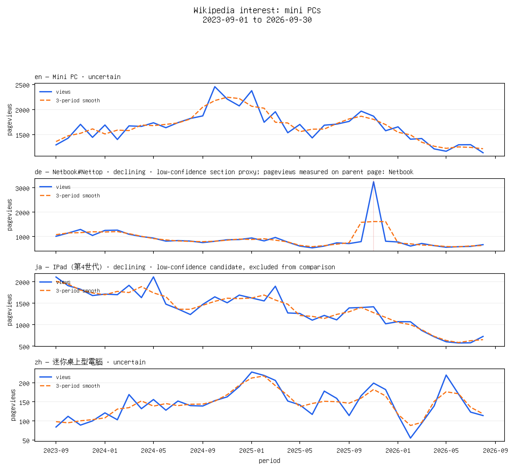
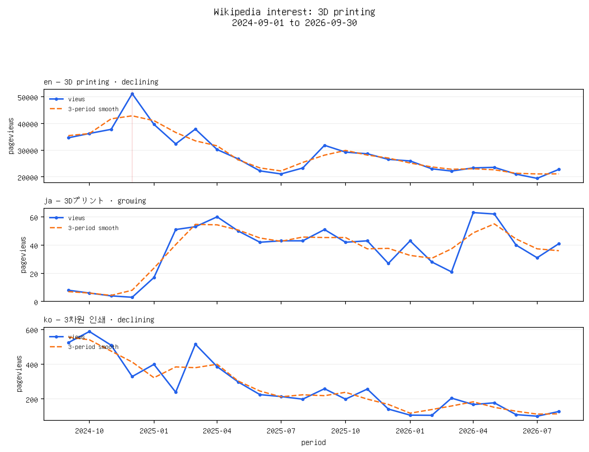

# Wikipedia Interest

[](https://github.com/HaidaDaniel/wikipedia-interest/actions/workflows/test.yml)

Wikipedia Interest is an Agent Skill and CLI that turns audience-research questions into reproducible Wikimedia Pageviews signals. An agent selects a topic, languages and dates; deterministic code resolves articles, calculates trends and evidence quality, and creates charts and one-page PDFs.

Wikipedia attention is an interest signal, not market size or purchase intent.

## Showcase

These examples use the last 36 or 24 complete months as of September 2026. The current incomplete month is excluded; all three runs end on 2026-08-31.

### Mini PC across Wikipedia editions



English `Mini PC` and Chinese `迷你桌上型電腦` are eligible, but both trends are uncertain with noisy fits. German `Netbook#Nettop` is a section of a broader article whose pageviews cover the whole parent page; the Japanese result is an unrelated iPad article. Both low-confidence proxies are shown for inspection and excluded from comparison.

[View one-page PDF](examples/artifacts/mini-pc/report.pdf) · [View result JSON](examples/artifacts/mini-pc/result.json)

### 3D printing across English, Japanese and Korean



All three editions resolve to high-confidence concept articles. English and Korean pageviews decline; Japanese pageviews grow, but from only about 36 views per month on average with a modest trend fit, so the large percentage change needs further validation. Reliability scores describe evidence quality and do not turn pageviews into market demand.

[View one-page PDF](examples/artifacts/3d-printing/report.pdf) · [View result JSON](examples/artifacts/3d-printing/result.json)

### Astronomy in Ukrainian Wikipedia


The high-confidence `Астрономія` article shows a declining trend across 24 complete months. Evidence quality is high, although a spike in September 2024 accounts for about 20% of the window's views and may affect the fitted trend.

[View one-page PDF](examples/artifacts/astronomy-uk/report.pdf) · [View result JSON](examples/artifacts/astronomy-uk/result.json)

## Example

Natural-language request:

> Compare the growth of interest in intermittent fasting in Polish and Czech Wikipedia over the last two years and tell me which signal is more reliable.

Command:

```bash
uv run wikipedia-interest analyze \
  --topic "intermittent fasting" --languages pl,cs \
  --start 2024-09 --end 2026-09 --granularity monthly --output output
```

The command prints one compact JSON object and saves a full `output/<run-id>/result.json`, `data.csv`, normalized `pageviews.json`, and `chart.png`. The persisted result includes observations; stdout omits them by default for small models. The agent can summarize `comparison.strongest_signal`, explain each `series[].metrics.trend_label`, and quote `series[].reliability.reasons`.

## Architecture

```text
user question
    ↓ agent maps intent to CLI flags
resolver → MediaWiki search + interlanguage links
    ↓
cached Wikimedia Pageviews → deterministic metrics/anomalies/reliability
    ↓
JSON + chart + one-page PDF → agent explanation with caveats
```

The LLM handles natural language and presentation. It does not write Python, calculate statistics, inspect a large CSV or select formulas.

## Why this works with a small agent model

The model only maps a request to a short command, then reads compact JSON fields that already contain the article, metrics, labels, anomaly notes and evidence-quality reasons. Formula choice, thresholds, caching, artifact paths and error codes are fixed in code. Follow-ups reuse `inspect-run` and `--from-run`, so the model does not need to remember a hidden state or parse hundreds of raw observations.

## Quick start

Requires Python 3.12+, `uv`, and network access for the first request.

```bash
uv sync
uv run wikipedia-interest analyze --topic astronomy --languages uk --start 2024-09 --end 2026-09
uv run wikipedia-interest report --run output/<run-id>
uv run wikipedia-interest inspect-run output/<run-id>
```

## Commands

`analyze` resolves each article, fetches daily/monthly observations, writes a reproducible run and chart, and prints stable compact JSON. Use `--criterion growth|stability|balanced`, `--no-cache`, `--from-run`, or `--verbose-json` when full observations are explicitly needed.

`report` creates `report.pdf` from the saved run without another API call.

`inspect-run` returns a compact context suitable for an agent follow-up.

Failed language resolutions remain visible as `unresolved/excluded` while successful languages continue through chart, comparison and PDF generation. If all languages fail, the CLI returns a machine-readable `NO_DATA` error.

Successful pageview retrieval and comparison eligibility are separate. Low-confidence article candidates remain visible but are excluded from comparison; `comparison.eligible_series_count`, `excluded_series_count` and `no_eligible_series` show which series can be compared. When none is eligible, `no_positive_growth_signal` is `null`; it is `true` only when eligible series exist and none shows positive growth. The top-level `partial` flag describes retrieval failures, so fully retrieved low-confidence series can still produce `partial: false` and `no_eligible_series: true`.

Invalid commands and malformed arguments also return the standard JSON error object on stdout with code `INVALID_REQUEST` and exit code 2; stderr has a short human-readable line.

## Install as an Agent Skill

This repository is itself the Agent Skill directory. The canonical instructions are in the root `SKILL.md`; the executable package, tests, documentation and committed demo artifacts are part of the same directory.

```bash
git clone https://github.com/HaidaDaniel/wikipedia-interest.git
cd wikipedia-interest
uv sync
# The repository root is the canonical skill.
```

Validate the root from its parent directory so the validator sees the skill directory name:

```bash
cd ..
uvx --from skills-ref agentskills validate wikipedia-interest
```

For OpenCode project-local discovery, this repository includes a compatibility directory whose only file is a relative symlink at `.agents/skills/wikipedia-interest/SKILL.md` pointing to the root instructions. This avoids a second source of truth and avoids recursive directory symlinks. If the file symlink is not preserved by a filesystem or archive, recreate it from the repository root:

```bash
mkdir -p .agents/skills
mkdir -p .agents/skills/wikipedia-interest
ln -s ../../../SKILL.md .agents/skills/wikipedia-interest/SKILL.md
```

The target must resolve to the repository root containing the canonical `SKILL.md`; do not create a second copied `SKILL.md` or a symlinked directory loop.

## Methodology and reliability

For longer windows the default is monthly aggregation. Only complete calendar periods are fetched: a requested current month is excluded and surfaced as `data_through` plus `partial_period_excluded`. Missing periods remain `views: null, observed: false`; genuine API zeroes remain `views: 0, observed: true` and are the only zeroes used in regression. The main trend is an annualized linear regression on observed `log1p(pageviews)`, paired with a rolling-smoothed trend and a 12-period YoY comparison when possible. A robust median/MAD detector marks spikes. Labels use fixed thresholds: ±10% annualized with fit/data checks. The source is the [Wikimedia Pageviews API](https://doc.wikimedia.org/generated-data-platform/aqs/analytics-api/reference/page-views.html).

Reliability means evidence quality, not statistical confidence. A transparent 0–100 heuristic rewards duration, completeness, meaningful signal, fit consistency and confident article resolution, and penalizes noise and spikes. See [METHODOLOGY.md](METHODOLOGY.md).

## Follow-up workflow

```bash
uv run wikipedia-interest inspect-run output/<run-id>
uv run wikipedia-interest analyze --from-run output/<run-id> --start 2025-09 --end 2026-09 --criterion stability
```

Every follow-up is a new run; prior pageview data remains reusable through `.cache/`.

## Validation

```bash
uv run pytest
```

The current suite has **51 tests passed** and covers metric direction, seasonality-aware YoY, real zeroes vs missing periods, cutoff, anomalies, reliability caps, resolver edge cases, section-fragment resolution and URL handling, retry behavior, compact JSON, font selection and fallback behavior, all-low-confidence comparison eligibility, argparse JSON errors, multilingual rendering, multi-series charts, report wording and persistence. Three real-data scenario commands are documented in [examples/README.md](examples/README.md). Network integration is intentionally manual and cache-friendly.

Validation evidence is split into [free-model-opencode.md](docs/validation/free-model-opencode.md) and [local-qwen-opencode.md](docs/validation/local-qwen-opencode.md). Post-fix cases are summarized in [post-fix-evaluation.md](docs/post-fix-evaluation.md). Both OpenCode runs passed; the Claude Haiku attempt was not validation because its provider reported insufficient funds. The Agent Skills validator passes when run against a checkout whose directory is named `wikipedia-interest`:

```bash
uvx --from skills-ref agentskills validate wikipedia-interest
```

## Limitations

One article is an imperfect proxy for a concept. Language editions vary in population, usage, coverage, title conventions and alternative pages. Pageviews can be event-driven and seasonal; recent periods may be incomplete. This MVP does not claim causal demand and does not combine external signals.

## Roadmap

Phase 2: Wikidata concept graphs, related-page groups, normalized language-audience signals and event annotation. Phase 3: batch topics, async retrieval and ranked research briefs. Phase 4: external product analytics integration and backtesting whether pageview signals predict validated demand.

## Reviewer path

Open the root `SKILL.md` for agent instructions, `PLAN.md` for architecture, `METHODOLOGY.md` for formulas, `src/wikipedia_interest/cli.py` for the contract, and `examples/README.md` for real scenario commands.
